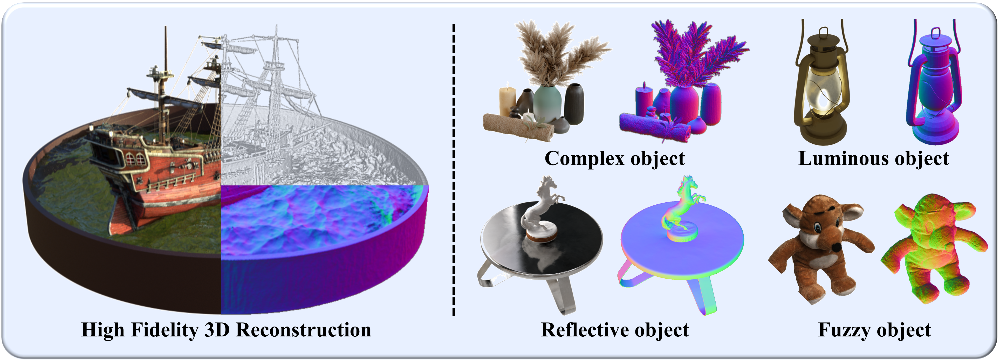

# AniSDF
### [[Paper]](https://arxiv.org/pdf/2410.01202v2) [[Project Page]](https://g-1nonly.github.io/AniSDF_Website/)

> [**AniSDF: Fused-Granularity Neural Surfaces with Anisotropic Encoding for High-Fidelity 3D Reconstruction**](https://arxiv.org/abs/2410.01202v2),            
> [Jingnan Gao](https://g-1nonly.github.io), Zhuo Chen, [Xiaokang Yang](https://english.seiee.sjtu.edu.cn/english/detail/842_802.htm), [Yichao Yan](https://daodaofr.github.io/)<br>
> **Shanghai Jiao Tong University**<br>
> **ICLR 2025**

Official implementation of "AniSDF: Fused-Granularity Neural Surfaces with Anisotropic Encoding for High-Fidelity 3D Reconstruction".

<div align="center">
  
</div><br/>

**The code will be released around April 10th.**

## BibTeX
```bibtex
@inproceedings{gao2025anisdf,
  title={AniSDF: Fused-Granularity Neural Surfaces with Anisotropic Encoding for High-Fidelity 3D Reconstruction}, 
  author={Jingnan Gao and Zhuo Chen and Xiaokang Yang and Yichao Yan},
  journal={ICLR},
  year={2025},
}
```
